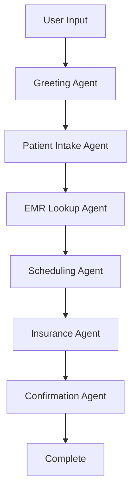

# AI Scheduling Agent for Hospitals 🏥🤖

An intelligent medical appointment scheduling system powered by LangGraph and Streamlit, designed to streamline hospital appointment booking through conversational AI.

## 🌟 Features

### 🤖 **Multi-Agent AI System**
- **Greeting Agent**: Welcomes patients and determines appointment type
- **Patient Intake Agent**: Collects and validates patient information
- **EMR Lookup Agent**: Searches electronic medical records
- **Scheduling Agent**: Handles appointment booking and doctor selection
- **Insurance Agent**: Verifies insurance coverage and copay information
- **Confirmation Agent**: Finalizes appointments and sends confirmations

### 🏥 **Hospital Management**
- **Doctor Schedules**: Automated generation of doctor availability
- **Patient Database**: Comprehensive patient record management
- **Appointment Tracking**: Real-time appointment status updates
- **Insurance Integration**: Support for multiple insurance providers

### 💻 **User Interface**
- **Web-based Interface**: Clean, responsive Streamlit application
- **Real-time Chat**: Conversational appointment booking
- **Progress Tracking**: Visual workflow progress indicators
- **Mobile Friendly**: Works on desktop and mobile devices

## 🚀 Quick Start

### Prerequisites
- Python 3.13+ (recommended)
- Virtual environment (recommended)

### Installation

1. **Clone the repository**
   ```bash
   git clone https://github.com/Tanishpd/hospital-ai-scheduler.git
   cd hospital-ai-scheduler
   ```

2. **Set up virtual environment**
   ```bash
   python3 -m venv venv
   source venv/bin/activate  # On Windows: venv\Scripts\activate
   ```

3. **Install dependencies**
   ```bash
   pip install -r requirements.txt
   ```

4. **Generate doctor schedules**
   ```bash
   python create_doctor_schedules.py
   ```

5. **Run the application**
   ```bash
   cd src
   streamlit run main.py
   ```

6. **Access the application**
   - Open your browser and go to: `http://localhost:8501`

## 📁 Project Structure

```
ai_scheduling_agent/
├── src/                          # Main source code
│   ├── main.py                   # Streamlit web application
│   ├── agent.py                  # Main LangGraph agent
│   ├── simple_agent.py           # Simplified agent implementation
│   ├── database.py               # Database management
│   ├── calendar_integration.py   # Calendar utilities
│   ├── reminder_system.py        # Email/SMS reminders
│   └── utils.py                  # Helper functions
├── data/                         # Data storage
│   ├── patients.csv              # Patient database
│   ├── appointments.csv          # Appointment records
│   └── doctor_schedules/         # Doctor availability files
├── scripts/                      # Utility scripts
│   └── expand_patient_schema.py  # Database schema expansion
├── templates/                    # HTML templates and forms
│   ├── email_templates.py        # Email templates
│   └── forms/                    # HTML forms
├── create_doctor_schedules.py    # Doctor schedule generator
├── requirements.txt              # Python dependencies
├── .env.template                 # Environment variables template
└── README.md                     # This file
```

## 🔧 Configuration

1. **Copy environment template**
   ```bash
   cp .env.template .env
   ```

2. **Edit .env file** (optional for basic usage)
   ```bash
   # LLM Configuration (FREE - No API key needed!)
   LLM_TYPE=mock_free
   
   # Clinic Information
   CLINIC_NAME=Healthcare Center
   CLINIC_PHONE=(555) 123-4567
   CLINIC_EMAIL=appointments@healthcarecenter.com
   ```

## 🏥 Available Doctors

The system includes 5 sample doctors with different specialties:

- **Dr. Johnson** - Internal Medicine (Room 101)
- **Dr. Wilson** - Cardiology (Room 205)  
- **Dr. Smith** - Pediatrics (Room 302)
- **Dr. Davis** - Dermatology (Room 150)
- **Dr. Brown** - Orthopedics (Room 220)

## 💡 Usage Examples

### Basic Appointment Booking
```
User: "I need to schedule an appointment"
Agent: "Hello! I'm your AI scheduling assistant. What's your full name?"
User: "John Smith"
Agent: "Thank you John! What's your phone number?"
```

### Appointment Cancellation
```
User: "I need to cancel my appointment"
Agent: "I'll help you cancel. What's your full name?"
User: "John Smith"
Agent: "Found your appointment! Which one would you like to cancel?"
```

### Doctor Preference
```
User: "I need to see Dr. Johnson next week"
Agent: "I'll book you with Dr. Johnson. Here are available times..."
```

## 🛠️ Technical Architecture

### LangGraph Multi-Agent Workflow


### Key Technologies
- **Frontend**: Streamlit (Web UI)
- **Backend**: Python, LangGraph, LangChain
- **Database**: CSV-based (easily upgradeable to SQL)
- **AI Framework**: Custom LangGraph implementation
- **Data Processing**: Pandas, OpenPyXL

## 📊 Database Schema

### Patients Table
- Patient ID, Name, DOB, Phone, Email
- Insurance carrier, Member ID, Group ID
- Emergency contacts, Medical history
- Demographics, Address information

### Appointments Table  
- Appointment ID, Patient ID, Doctor
- Date, Time, Duration, Status
- Insurance verification status
- Confirmation details

## 🔄 Workflow States

1. **Start**: Initial greeting and routing
2. **Patient Intake**: Collect patient information
3. **EMR Lookup**: Search existing records
4. **Scheduling**: Book appointment slots
5. **Insurance**: Verify coverage
6. **Confirmation**: Finalize and confirm
7. **Complete**: Send confirmations

## 🧪 Testing

Run the LangGraph agent test:
```bash
cd src
python -c "
from simple_agent import simple_langgraph_agent
response = simple_langgraph_agent.process_user_input('Hello, I need an appointment')
print(response)
"
```

## 📈 Features Roadmap

- [ ] Integration with real EMR systems
- [ ] SMS reminder system
- [ ] Multi-language support
- [ ] Advanced AI models (GPT-4, Claude)
- [ ] Mobile app development
- [ ] Telehealth integration
- [ ] Analytics dashboard
- [ ] Payment processing

## 🤝 Contributing

1. Fork the repository
2. Create a feature branch (`git checkout -b feature/AmazingFeature`)
3. Commit your changes (`git commit -m 'Add some AmazingFeature'`)
4. Push to the branch (`git push origin feature/AmazingFeature`)
5. Open a Pull Request

## 📝 License

This project is licensed under the MIT License - see the [LICENSE](LICENSE) file for details.

## 📞 Support

For support, please open an issue on GitHub or contact:
- Email: support@yourorganization.com
- GitHub Issues: [Create an issue](https://github.com/Tanishpd/hospital-ai-scheduler/issues)

## 🙏 Acknowledgments

- Built with [Streamlit](https://streamlit.io/)
- Powered by [LangGraph](https://langchain-ai.github.io/langgraph/) and [LangChain](https://langchain.com/)
- Inspired by modern healthcare digitization needs

---

**Made with ❤️ for better healthcare accessibility**
